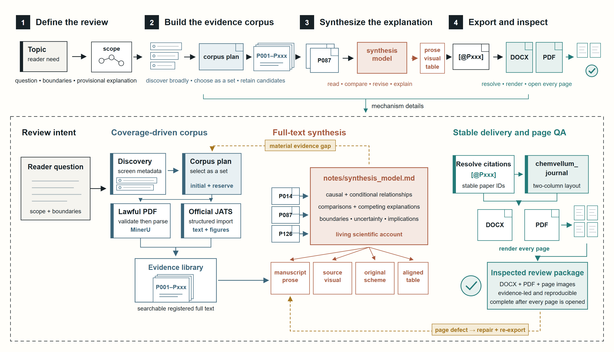
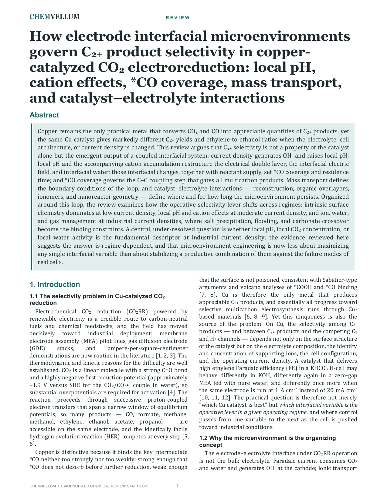
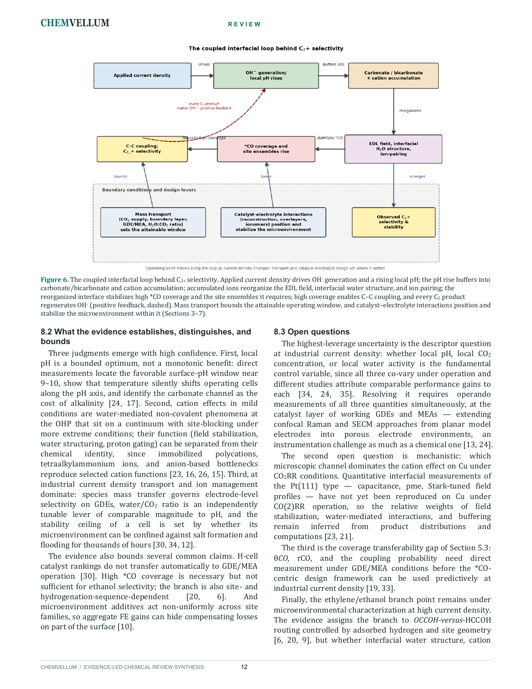
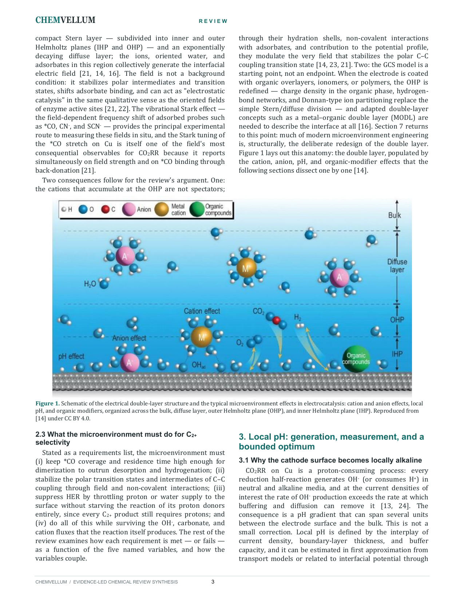
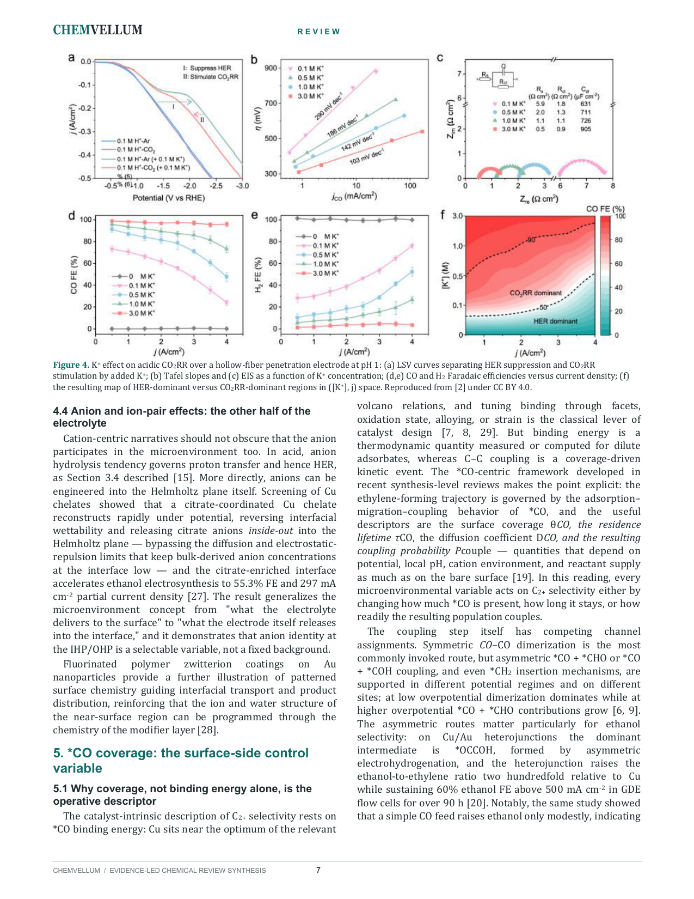
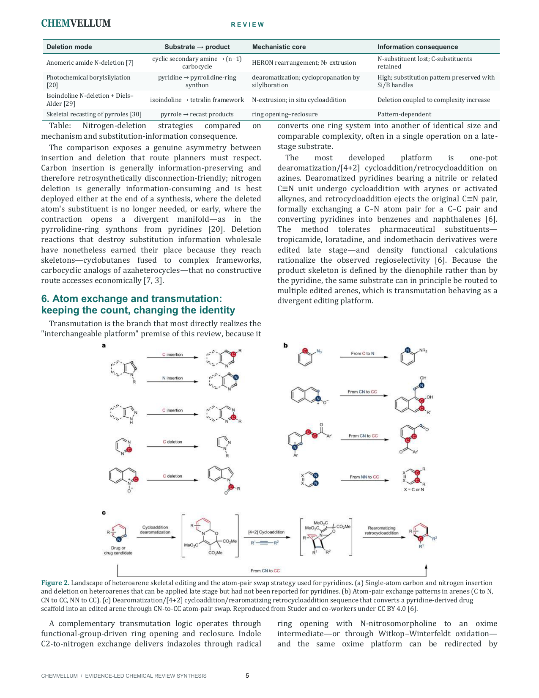
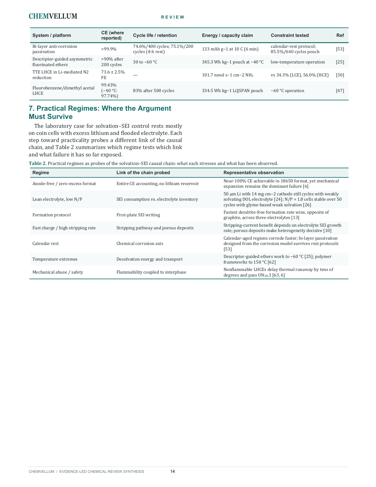
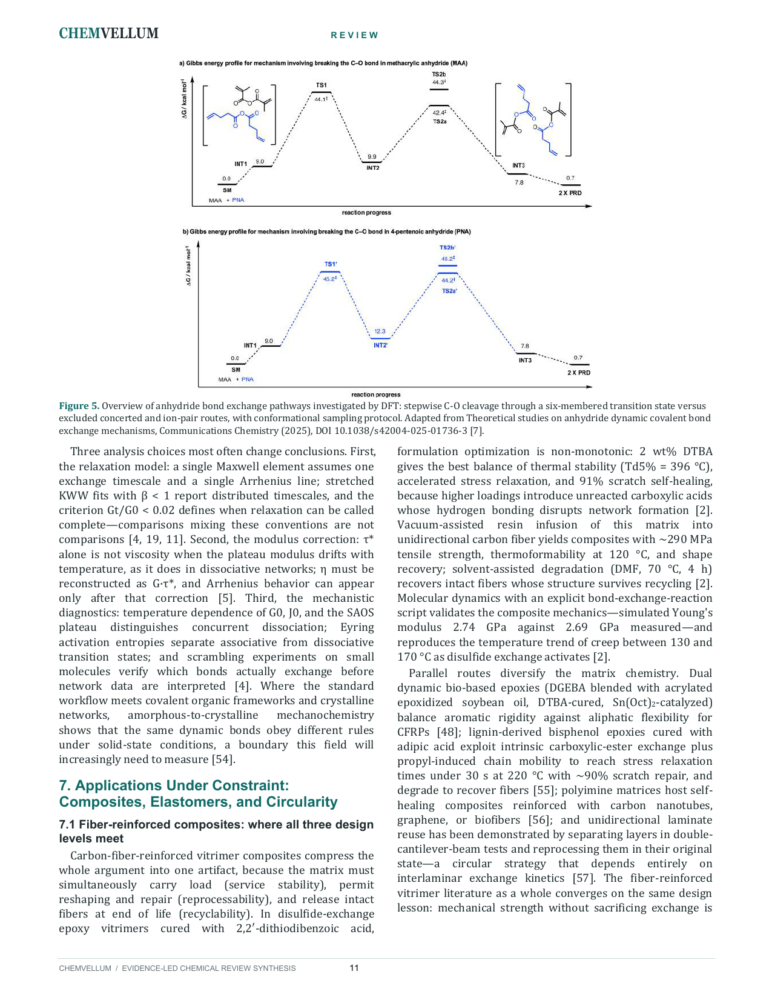
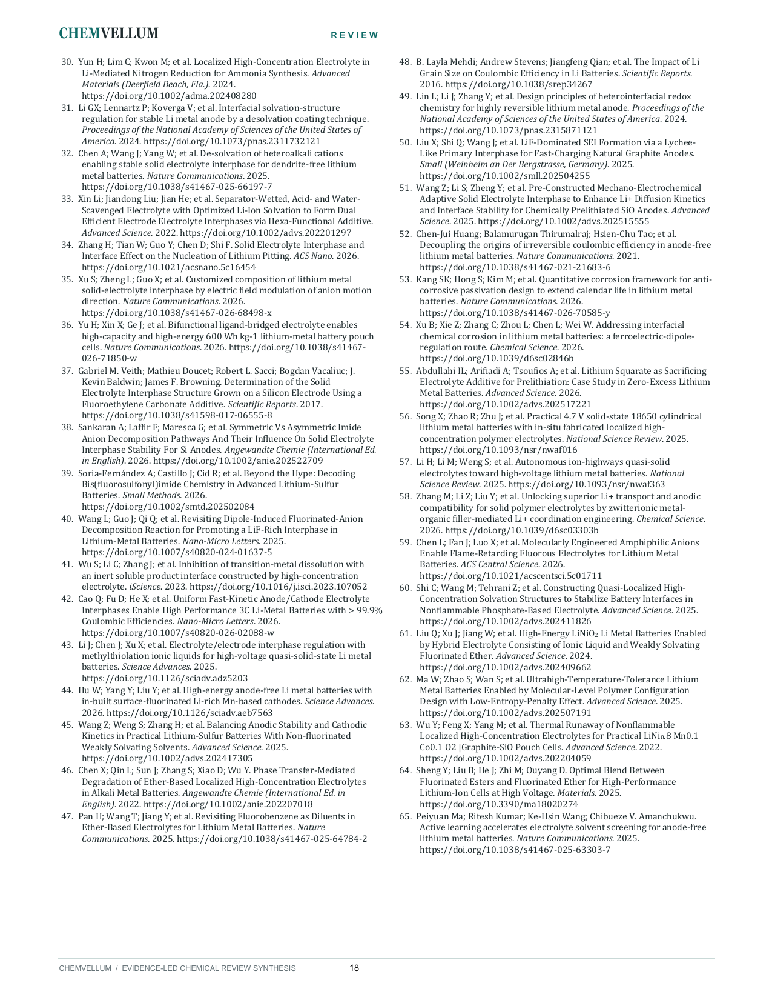

# ChemVellum

<p align="center">
  <strong>Evidence-led chemistry reviews, from a topic to inspected DOCX and PDF.</strong>
</p>

<p align="center">
  <a href="https://github.com/TengJiao33/ChemVellum/actions/workflows/tests.yml"></a>
  
  
  
</p>

<p align="center">
  
</p>

ChemVellum turns a chemistry question into a review grounded in registered full
text. It plans a coverage-driven corpus, reads and compares the evidence,
maintains a living scientific explanation, resolves stable citations, prepares
useful figures and tables, exports DOCX and PDF, and inspects every rendered
page before delivery.

The repository packages the workflow as **8 agent Skills**, supported by **20
deterministic Python scripts** for retrieval, storage, parsing, provenance,
citation resolution, export, and page rendering. The model is responsible for
scientific judgment and explanation; scripts keep the surrounding operations
repeatable and auditable.

## Highlights

- **Coverage-driven evidence corpus.** Candidate papers are screened as a set
  against the reader question, scope, comparisons, and anticipated evidence
  gaps.
- **Registered full-text evidence.** Search results and abstracts guide
  discovery; substantive claims are developed from lawful, searchable full
  text with stable paper identities.
- **Living synthesis model.** `notes/synthesis_model.md` records the current
  causal and conditional explanation, competing accounts, boundaries,
  uncertainty, and implications.
- **One explanation, several views.** Manuscript prose, source visuals,
  original diagrams, chemical Schemes, and evidence tables express the same
  scientific account at useful levels of detail.
- **Inspected delivery.** Citation resolution, DOCX/PDF export, page rendering,
  and inspection form one continuous delivery loop.

## Quick start

```bash
git clone https://github.com/TengJiao33/ChemVellum.git
cd ChemVellum
python -m venv .venv
```

Windows PowerShell:

```powershell
.\.venv\Scripts\Activate.ps1
python -m pip install --upgrade pip
python -m pip install -r requirements.txt
```

macOS or Linux:

```bash
source .venv/bin/activate
python -m pip install --upgrade pip
python -m pip install -r requirements.txt
```

Open the repository root in an agent that supports project Skills, then provide
a chemistry topic and ask for a review. For example:

> Write a review on how electrode interfacial microenvironments govern C₂+
> product selectivity in copper-catalyzed CO₂ electroreduction, focusing on
> local pH, cation effects, *CO coverage, mass transport, and
> catalyst–electrolyte interactions.

The repository-level [`AGENTS.md`](AGENTS.md) routes topic-to-review requests to
the canonical end-to-end Skill. Qoder discovers the thin adapter under
`.qoder/skills/chemvellum-review-e2e/`. Manuscripts and final deliverables use
English by default; request another language explicitly when needed.

Copy `.env.example` to `.env` when an external service is required, and add
only the credentials for services you use.

## How it works

<p align="center">
  <a href="docs/assets/readme/workflow-overview.png">
    
  </a>
</p>

| Stage | Managed objects | Main work |
|---|---|---|
| **1. Define the review** | Reader question, scope, boundaries | Establish the decision-relevant question, comparisons, and provisional explanation. |
| **2. Build the evidence corpus** | Discovery results, corpus plan, registered papers | Discover broadly, choose papers for complementary coverage, acquire lawful full text, and preserve reserve candidates for gap filling. |
| **3. Synthesize the explanation** | Full text, synthesis model, manuscript, visuals, tables | Read, compare, revise causal relationships, state uncertainty, and develop the reader-facing account. |
| **4. Export and inspect** | Stable citations, DOCX, PDF, page images, inspection record | Resolve paper IDs, render both formats, open every page, repair defects, and re-export when required. |

The living synthesis model connects corpus construction, manuscript writing,
and visual design. Material evidence gaps trigger targeted discovery. Page
defects return to the manuscript or export layer for repair.

## Output gallery

The examples below are complete rendered pages from ChemVellum review runs.
They show the journal layout, source-figure integration, quantitative evidence,
original synthesis diagrams, chemical Schemes, aligned tables, and references.
Click any page to inspect it at full resolution.

<table>
  <tr>
    <td width="50%" valign="top">
      <a href="docs/assets/readme/review-cover.png"></a><br>
      <sub><strong>Review opening.</strong> Title, abstract, keywords, and the beginning of the scientific argument. CVR-0008, page 1.</sub>
    </td>
    <td width="50%" valign="top">
      <a href="docs/assets/readme/review-synthesis-figure.png"></a><br>
      <sub><strong>Original synthesis figure.</strong> A coupled interfacial loop developed from the review's synthesis model. CVR-0008, page 12.</sub>
    </td>
  </tr>
  <tr>
    <td width="50%" valign="top">
      <a href="docs/assets/readme/review-source-figure.png"></a><br>
      <sub><strong>Source visual in context.</strong> An electrochemical double-layer figure placed beside the prose it supports. CVR-0008, page 3.</sub>
    </td>
    <td width="50%" valign="top">
      <a href="docs/assets/readme/review-data-figure.png"></a><br>
      <sub><strong>Quantitative evidence.</strong> K⁺-gating data discussed together with mechanistic interpretation and scope. CVR-0008, page 7.</sub>
    </td>
  </tr>
  <tr>
    <td width="50%" valign="top">
      <a href="docs/assets/readme/review-chemistry-schemes.png"></a><br>
      <sub><strong>Chemical Schemes.</strong> Reaction structures remain legible inside the two-column manuscript. CVR-0004, page 5.</sub>
    </td>
    <td width="50%" valign="top">
      <a href="docs/assets/readme/review-evidence-tables.png"></a><br>
      <sub><strong>Aligned evidence tables.</strong> Comparable conditions and outcomes are normalized for direct reading. CVR-0007, page 14.</sub>
    </td>
  </tr>
  <tr>
    <td width="50%" valign="top">
      <a href="docs/assets/readme/review-energy-landscape.png"></a><br>
      <sub><strong>Mechanistic energy landscape.</strong> DFT exchange pathways are interpreted alongside characterization choices and application constraints. CVR-0006, page 11.</sub>
    </td>
    <td width="50%" valign="top">
      <a href="docs/assets/readme/review-references.png"></a><br>
      <sub><strong>Resolved references.</strong> Stable paper-ID citations rendered as a complete bibliography. CVR-0007, page 18.</sub>
    </td>
  </tr>
</table>

Source figures shown in this gallery have reuse rights recorded in their
project asset manifests. Original diagrams, tables, and page composition are
generated as part of the review workflow.

## Architecture

ChemVellum has three cooperating layers:

1. **Control plane** — `AGENTS.md` and `chemvellum-review-e2e` own the complete
   topic-to-deliverable run and route work to component Skills.
2. **Evidence and project state** — the managed paper library and each numbered
   review project preserve full text, metadata, corpus decisions, synthesis,
   assets, citations, and delivery records.
3. **Deterministic tools** — 20 scripts perform repeatable operations around
   discovery, parsing, registration, retrieval, citation, export, and QA.

| Skill | Scripts | Responsibility |
|---|---:|---|
| `chemvellum-review-e2e` | 0 | Own the complete run and continue through inspected DOCX/PDF output. |
| `review-topic-paper-discovery` | 4 | Create projects, plan searches, discover sources, and ingest lawful full text. |
| `mineru-precise-parse-chemvellum` | 1 | Parse PDFs with MinerU while preserving Markdown, images, JSON, and archives. |
| `review-metadata-prep` | 7 | Register papers, validate portable metadata, and repair paths after relocation. |
| `review-writing-tools` | 2 | Develop the scientific explanation, search the library, and inspect manuscripts. |
| `review-source-figure-tools` | 1 | Inventory source figures, Schemes, and tables for selection. |
| `review-citation-assets` | 2 | Insert selected assets and generate stable citations and references. |
| `review-export-docx` | 3 | Export DOCX, audit structure, render PDF, and produce page images. |

Key entry points:

- [End-to-end review Skill](skills/chemvellum-review-e2e/SKILL.md)
- [Scientific synthesis and writing Skill](skills/review-writing-tools/SKILL.md)
- [Compact workflow guide](skills/技能工作流说明.md)

## Repository layout

```text
ChemVellum/
├─ AGENTS.md                       # topic-to-E2E routing
├─ .qoder/skills/                  # thin Qoder adapter
├─ skills/                         # 8 Skills and 20 Python scripts
├─ tests/                          # maintained unittest suite
├─ view/                           # optional local artifact browser
├─ template/                       # export and reference templates
├─ docs/assets/readme/             # public README media
├─ review-library/                 # managed metadata and registry
├─ chem_papers/                    # local source PDFs; ignored by Git
├─ mineru-outputs/
│  ├─ markdown/                    # normalized full text; ignored by Git
│  ├─ extracted/                   # figures and structured parse output
│  ├─ raw_zips/                    # original MinerU result archives
│  └─ runs/                        # immutable parse manifests
├─ review-projects/                # CVR-0001-topic, CVR-0002-topic, ...
└─ workspace/experiments/          # EXP-YYYYMMDD-001-topic, ...
```

Tracked placeholders preserve the runtime directory structure in a fresh
clone. Each working checkout develops its own paper library, generated
projects, and experiment history.

## Requirements

- Python 3.11 or later
- packages in `requirements.txt`
- network access for external discovery and acquisition
- a MinerU API token when PDF parsing uses MinerU
- Microsoft Word on Windows for real DOCX-to-PDF conversion
- Poppler or MiKTeX `pdftoppm` for page-image rendering

## Verification

Run the maintained test suite from the repository root:

```bash
python -m unittest discover -s tests -p "test_*.py"
```

Check the managed-library interface:

```bash
python skills/review-writing-tools/scripts/search_library.py --review-root . --query "reaction mechanism selectivity limitation"
```

An empty result is expected before papers have been added.

<details>
<summary><strong>Manual workflow and recovery commands</strong></summary>

Create the next numbered review project:

```bash
python skills/review-topic-paper-discovery/scripts/create_project.py --review-root . review --topic "your chemistry question"
```

Discovery writes `00_discovery/corpus_plan.draft.json`. Screen the initial
corpus as a set, record the selected paper keys and rationale, and retain
reserve candidates for later evidence gaps.

Parse locally obtained PDFs when required:

```bash
python skills/mineru-precise-parse-chemvellum/scripts/parse_chemvellum_pdfs.py --input-dir chem_papers
```

Register or refresh the managed library:

```bash
python skills/review-metadata-prep/scripts/prepare_metadata.py --review-root . --mineru-output mineru-outputs --pdf-root chem_papers --discover-from-pdf-root --append-registry
```

Maintain the current explanation in
`review-projects/<project_id>/notes/synthesis_model.md` and the canonical
reader-facing manuscript in
`review-projects/<project_id>/manuscript.md`. Resolve stable citations and
selected assets before export, then inspect every rendered PDF page.

For an isolated benchmark or QA attempt:

```bash
python skills/review-topic-paper-discovery/scripts/create_project.py --review-root . experiment --topic "retrieval smoke test"
```

Project, experiment, paper, discovery-run, and MinerU-run identifiers use
separate namespaces: `CVR-*`, `EXP-*`, `P*`, and timestamped run IDs.

</details>

## Moving an existing working library

Copy the complete project directory, including ignored runtime data, then run:

```bash
python skills/review-metadata-prep/scripts/remap_source_paths.py --review-root . --extract-archives --write
```

Managed paths remain relative to the repository when their sources are inside
the checkout. External sources can be moved into the standard storage layout
for a fully portable project.

## Optional local browser

```bash
python view/serve_review_dashboard.py --review-root . --host 127.0.0.1 --port 8765
```

Open `http://127.0.0.1:8765` to browse local artifacts.

## Data and publication boundary

- Copyrighted PDFs, extracted full text, generated manuscripts, rendered
  projects, experiment archives, and credentials stay in ignored local
  directories unless their distribution rights are explicit.
- Source identity, figure provenance, license evidence, and stable citation IDs
  travel with the review project.
- Script reports record mechanical observations. Scientific support, synthesis
  quality, lawful reuse, and page appearance remain editorial judgments.
